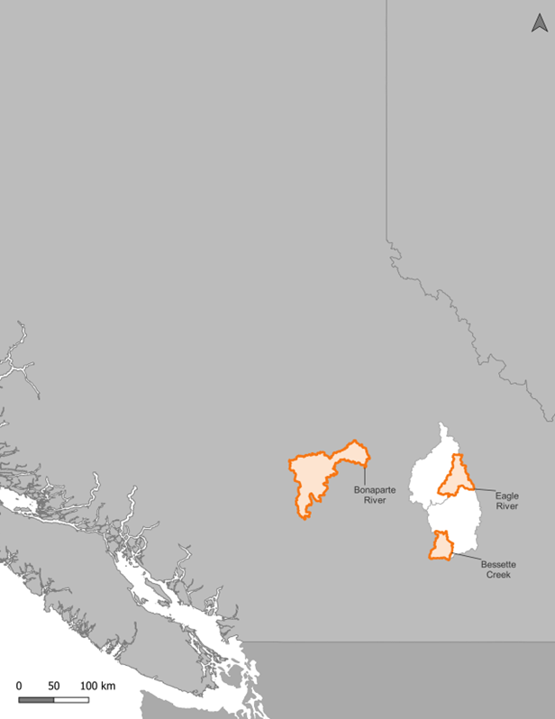

# Introduction {-}

## Purpose{-}

Many important salmon populations in the homeland of the Secwépemc people of B.C. are in precipitous decline. Vital spawning and rearing grounds have been severely altered by past and ongoing land use activities such as forestry and agriculture, as well as by recent summer heat waves, devastating wildfires, and severe drought. All these factors are being exacerbated by climate change impacts on weather patterns. In addition, natural and man-made barriers to salmon migration are extensive in the region and are undoubtedly limiting access to high-quality salmon spawning and rearing habitats. 

The purpose of the Thompson-Shuswap Watershed Connectivity Restoration Plan (WCRP) is to provide a strategic framework for addressing barriers to fish movement and increasing connectivity to high-value spawning and rearing habitats in the Eagle River, Bonaparte River, and Bessette Creek watersheds. This will be achieved by identifying, prioritizing, and addressing barriers to fish passage, with a focus on structures that block the most high-quality habitat. Actions will be guided by the best available science, local knowledge, and community priorities, with an emphasis on collaboration with local communities, Indigenous Nations, stewardship groups, and government agencies. By conducting both desktop and field assessments, the project aims to evaluate the extent to which manmade structures block migration and identify opportunities for increasing connectivity for salmonid species. This assessment will guide the prioritization of barriers for fish-passage restoration, ensuring that the most impactful sites are addressed first to enhance salmon habitat and improve migration conditions. The project will also provide valuable data for future restoration strategies and contribute to the Provincial Stream Crossing Information System (PSCIS) database to support long-term salmon conservation efforts. Through collaboration with stakeholders, restoration strategies will be developed to restore connectivity and improve ecosystem health within the region.  

Local data and knowledge are combined with connectivity modelling to estimate current connectivity status and identify structures that potentially block the most habitat. This informs the prioritization of field assessments to close the most significant knowledge gaps efficiently. Information from field assessments of barrier status and habitat condition are incorporated into the model, improving understanding of which barriers block the most habitat. 

This information is also used to inform and plan restoration efforts. Structure rankings inform restoration prioritization by summarizing what is known about fragmentation and showing the relative amount of habitat upstream of each barrier. Actual prioritization of restoration activities is a social decision that requires additional information, including the quality and condition of upstream habitat, the cultural importance of different areas within the watershed, and the costs and logistics of addressing each barrier relative to the ecological benefits of doing so. 

As knowledge gaps are closed and barriers are addressed, this plan is revised to summarize progress and provide updated estimates of connectivity status and the status and relative importance of remaining structures. 

## Vision Statement  {-}

To restore and protect the salmon populations of the Thompson-Shuswap region through collaborative, holistic, and culturally grounded approaches that honor the Secwépemc people's traditional knowledge and rights. By fostering sustainable fisheries practices, strengthening Secwépemc stewardship, and addressing the cumulative impacts of land use and climate change, we aim to ensure thriving ecosystems, resilient communities, and a prosperous future for salmon and all living beings connected to them. By systematically addressing barriers, this plan aims to increase watershed connectivity, support sustainable fish populations, achieve measurable ecological benefits, and contribute to the long-term resilience and health of these ecosystems. 

## Scope  {-}

The primary geographic scope of this WCRP encompasses the Thompson-Shuswap watersheds, situated within Secwepemcúl’ecw, the traditional territory of the Secwépemc People, in south-central British Columbia. This project specifically includes the Bonaparte River, Bessette Creek, and Eagle River watersheds (@fig-geoscope). The Bonaparte River watershed is represented by the St’uxwtéws (Bonaparte First Nation), while the Splatsin te Secwépemc (Splatsin First Nation) stewards the Eagle River and Bessette Creek watersheds. These areas are integral to the ecological and cultural fabric of the region and are critical for the implementation of connectivity enhancements to support anadromous salmonids. 

The defined scope aligns with strategic conservation efforts aimed at restoring and enhancing salmonid habitat connectivity. This initiative is part of a broader strategy to address aquatic ecosystem health across key watersheds for focused conservation actions. By concentrating efforts in these watersheds, the WCRP aims to make significant strides in reversing habitat fragmentation and improving the survival prospects of culturally and ecologically significant fish populations. 

{#fig-geoscope}
 

### Eagle River 
The Eagle River watershed, situated in British Columbia and forming part of the expansive Fraser River drainage basin through the Thompson River, originates in the mountains west of Revelstoke and makes its journey to Shuswap Lake at Sicamous. This vital ecological corridor is enriched by significant tributaries, notably the Perry River, which converges with the Eagle River near Malakwa. The watershed supports a rich biodiversity, including key fish species such as both anadromous Sockeye Salmon and the land-locked life history type of Sockeye Salmon known as kokanee; Rainbow Trout (*O. mykiss*), Coho Salmon, and Chinook Salmon, all reliant on its diverse aquatic habitats. 

The watershed traverses landscapes that exhibit a blend of natural beauty and human influence, impacting its ecological dynamics. Its hydrological and geomorphological features include dynamic river channels, extensive riparian zones, and floodplains crucial to the region’s ecological integrity. The river’s substrate varies from gravel beds and cobble to fine sediments, which significantly influence water flow and habitat quality.

### Bessette Creek 
Bessette Creek is a principal tributary of the Shuswap River that plays a crucial role in the ecological health and biodiversity of the region. Originating near Lumby, B.C., this creek spans approximately 35.4 kilometers and drains a substantial watershed area of about $794 km^{2}$. The creek forms by the confluence of Harris and Creighton creeks, with Duteau Creek joining downstream, enhancing its ecological and hydrological complexity. 

The lower stretches of Bessette Creek are particularly critical, providing essential spawning and rearing habitats for Chinook and Coho salmon, as well as Rainbow Trout. This section of the creek represents the uppermost accessible stream for all anadromous fish within the Shuswap River system, underscoring its importance for regional salmonid populations. 

Human activities and natural processes have significantly influenced the physical and biological conditions of the creek, impacting its capacity to support native wildlife. Recent efforts to document and improve the creek's aquatic habitats have underscored the need for continued conservation and restoration initiatives. These efforts focus on mitigating the effects of reduced flow rates and increased sedimentation, which pose significant challenges to the spawning salmonids that rely on these waters. 

Conservation strategies are aimed at preserving Bessette Creek's role as a critical ecological corridor within the Shuswap watershed, ensuring it continues to support a diverse array of aquatic life and maintain its ecological functions. 

### Bonaparte River 
The Bonaparte River is a dynamic and ecologically significant waterway that extends approximately 153 km from its headwaters within the Fraser Plateau, flowing through Bonaparte Lake, Young Lake, and then south towards Highway 97 before its confluence with the Thompson River in Ashcroft. This river is an integral component of the Thompson River system, which is renowned for supporting a diverse array of aquatic life including several species of Pacific salmon and other fish species. 

Major tributaries, including Hat Creek, Clinton Creek, Loon Creek, and Chasm Creek, enhance the ecological complexity of the Bonaparte River. These tributaries contribute significantly to the river’s flow and biodiversity, supporting habitats critical for species such as the anadromous life history form of Rainbow Trout known as steelhead; Pink (*O. gorbuscha*), Coho, and Chinook salmon, as well as non-anadromous species like kokanee and Rainbow Trout. The river’s ecology is bolstered by a variety of habitats, including high-gradient riffle-pool sequences essential for juvenile rearing and adult spawning. The landscape is characterized by the river’s sinuous flow through glaciofluvial and lacustrine sediments, contributing to a predominantly riffle-pool hydraulic character along with complex channel morphology. 

Human activities and natural processes have shaped the river’s condition over time, impacting its bank stability and aquatic habitats. Approximately 30% of the river’s left bank and 44% of the right bank have experienced medium to high levels of impact due to agriculture, development, and other anthropogenic influences (McGill et al. 2020). Despite these challenges, the Bonaparte River remains a vital ecological corridor, offering essential spawning and rearing habitats that are crucial for the survival and propagation of its fish populations. 

Conservation efforts in the Bonaparte River watershed focus on mitigating the impacts of reduced flows and increased sedimentation, significant challenges for spawning salmonids. The health of the river is monitored through comprehensive habitat inventories and assessments, aiming to preserve its role as a critical habitat corridor within the larger Thompson watershed. 

## Focal Species {-}
Salmonids, including Chinook Salmon, Coho Salmon, Sockeye Salmon, and steelhead, play indispensable roles both ecologically and culturally within the Secwépemc territories (Table 1). Ecologically, these species are pivotal in transferring marine-derived nutrients from the ocean to freshwater ecosystems, significantly bolstering the ecological health of their environments. This transfer enriches a broad spectrum of terrestrial and aquatic life, elevating ecosystem productivity and stability. Their presence within the food web is crucial for sustaining biodiversity, underpinning the ecological dynamics of the region (Cederholm et al. 2000). 

Focal species within these watersheds include the threatened Interior Fraser River Coho Salmon, the endangered Thompson River steelhead, as well as endangered populations of Sockeye Salmon and multiple runs of Chinook Salmon (Table 2 and Table 3). These species are vital not only for their ecological roles but also for their longstanding economic, cultural, and ceremonial importance to the Secwépemc communities. Historically, these waters have sustained rich salmonid populations that have supported local indigenous communities for generations. 

Table 1: Focal fish species in the Eagle and Bonaparte River and Bessette Creek watersheds. The Secwépemc, and Western common and scientific species names are provided. 

Culturally, salmonids are woven into the fabric of Secwépemc life, having sustained generations through their roles in diet, spiritual practices, and social structures. They are celebrated in various cultural practices closely linked to their life cycles, playing a vital role in the transmission of ecological knowledge and traditions across generations. The enduring relationship between the Secwépemc people and these salmon species highlights a profound connection that spans both spiritual and sustenance-based needs, illustrating the deep cultural reverence for these fish (Walters et al. 2018). 

### Chinook Salmon | Kekèsu | *Oncorhynchus tshawytscha* {-}
Chinook Salmon, or Kekésu7 as known in Secwepemctsin is the largest species of Pacific salmon (DFO, 2020). Populations are categorized as “stream-type” or “ocean-type.”  Interior systems with snow-dominated hydrological regimes tend to support populations of stream-type Chinook that overwinter for a year or more. Chinook that spawn and rear in the Deadman River and Bessette Creek are a part of the Designatable Units 15 and 14 respectively, and were both designated Endangered by the Committee on the Status of Endangered Wildlife in Canada (COSEWIC; COSEWIC, 2018; COSEWIC, 2020a). 

Lower Thomspon River Chinook species (Bonaparte) face several continuing and severe threats in their freshwater and marine habitats, including post-Pine Beetle deforestation, short and long-term effects from wildfires (the large Elephant Hill fire occurred here in 2018), habitat destabilization, and climate-change induced disruption to water quality. Agriculture water withdrawal is substantial and ongoing (DFO 2020). 

Table 2: Chinook Salmon Conservation Units in the Eagle River, Bonaparte River and Bessette Creek watersheds. Assessments undertaken by the [Pacific Salmon Foundation (2025)](https://www.salmonexplorer.ca/#!/pop=ABUNDANCE_TREND). 

Table 3: Chinook Salmon COSEWIC Designated Units and their status for the Eagle River, Bonaparte River and Bessette Creek watersheds (COSEWIC, 2018; COSEWIC, 2020a). 

### Sockeye Salmon | Sqlelten7ùwi | *Oncorhynchus nerka*  {-}
Sockeye salmon, or Sqlélten as known in Secwepemctsín, are an essential part of the ecosystem in British Columbia, existing as isolated populations in freshwater systems that have adapted to their specific local environments over generations (COSEWIC 2017). These salmon are a vital link in both the freshwater and marine food chains. Juvenile Sockeye Salmon are born in the pristine rivers and lakes, where they spend the first 2 years of their lives, rearing in the nutrient-rich freshwater habitat before beginning their journey to the ocean. Once they reach the ocean, they spend several years maturing before returning to their natal streams as adults. Sockeye Salmon typically range in age from 3 to 6 years old, with the majority of Fraser River Sockeye returning as 4-year-olds, though this can vary based on environmental conditions. As part of their life cycle, Sockeye exhibit a phenomenon known as “cyclic dominance,” where the population experiences large fluctuations in abundance, with peaks occurring every four years. During their spawning migration, adult Sockeye undergo dramatic physical transformations, turning a vibrant red with a greenish head, a display that could be attributed to their rich diet of shrimp, crustaceans, and other marine organisms while at sea. This striking coloration plays an important role in mate selection during spawning. However, despite their resilience and remarkable life cycle, data from the Pacific Salmon Explorer (Pacific Salmon Foundation 2025) indicates that the population of Eagle River Sockeye and other Sockeye species in the region have been in decline, likely due to a combination of climate change, habitat degradation, and overfishing, which threaten their long-term survival. 

Table 4: Sockeye Salmon Conservation Units in the Eagle River watershed. Assessments undertaken by the [Pacific Salmon Foundation (2025)](https://www.salmonexplorer.ca/#!/pop=ABUNDANCE_TREND). 

Table 5: Sockeye Salmon COSEWIC Designated Units and their status for the Eagle River watershed (COSEWIC 2017).

### Coho Salmon | Sxeyqs | *Oncorhynchus kisutch* {-}
Interior Fraser Coho, or Sxeyqs as known in Secwepemctsín, represent a unique genetic lineage of Coho Salmon. These salmon initially migrated to the Fraser River watershed through post-glacial lake connections from middle/upper Columbia River populations, which are now extinct. Today, the Interior Fraser Coho are the last remaining descendants of this distinct genetic group (Northcote and Larkin, 1989). Exhibiting strong spawning site fidelity, the Interior Fraser Coho contribute to the diversity of genetically distinct populations within the species. They are divided into five sub-groups: North Thompson, South Thompson, Lower Thompson, Fraser Canyon area, and Middle/Upper Fraser (Holtby and Ciruna, 2007). Designated as Endangered by COSEWIC in 2002 (COSEWIC, 2002), the Interior Fraser Coho faces threats from adverse marine conditions, overexploitation, and freshwater habitat degradation. A recent improvement in their status led to their reclassification as Threatened in 2016 (COSEWIC, 2016). 

Table 6: Coho Salmon Conservation Units in the Eagle River, Bonaparte River and Bessette Creek watersheds. Assessments undertaken by the [Pacific Salmon Foundation (2025)] (https://www.salmonexplorer.ca/#!/pop=ABUNDANCE_TREND). 

Table 7: Coho Salmon COSEWIC Designated Units and their status for the Eagle River, Bonaparte River and Bessette Creek watersheds (COSEWIC, 2016). 

### Steelhead | Sgwígwle | *Oncorhynchus mykiss* {-}
Rainbow Trout, a species in the salmonidae family, demonstrate two main life histories: migratory and resident. The determination of whether a Rainbow Trout will adopt a migratory or resident lifestyle is influenced by genetic factors and environmental conditions (Neave, 1944; Doctor et al., 2014). In certain populations, environmental triggers cause juveniles to migrate to the sea, adopting an anadromous life cycle known as steelhead or Sgwígwle in Secwepemctsín. These fish eventually return to their native streams to spawn. Specifically, the steelhead in the Bonaparte River watershed belong to a subgroup called Thompson River steelhead, which also includes populations from the Deadman and Nicola watersheds (Bison, 2023). This group exhibits distinct genetic and environmental interactions compared to other populations. Currently, there is no targeted research exploring the genetic differences between Thompson River steelhead and resident Rainbow Trout (COSEWIC, 2020*b*). In 2018, Thompson River steelhead were classified as Endangered by COSEWIC, a designation applied to species that have seen a reduction of 70% or more in the number of mature individuals over ten years or three generations (whichever is longer), with a significant risk of becoming extirpated or extinct (COSEWIC, 2021). 

Table 8: Steelhead Conservation Units in the Bonaparte River watershed.  Assessments undertaken by the [Pacific Salmon Foundation (2025)](https://www.salmonexplorer.ca/#!/pop=ABUNDANCE_TREND). 

Table 9: Steelhead COSEWIC Designated Units and their status for the Bonaparte River watershed (COSEWIC, 2020*b*). 

## Barrier Types {-}
Connectivity models in this WCRP focus on longitudinal habitat fragmentation by anthropogenic structures, including all types of dams and stream crossings. Diffuse natural barriers that make entire areas impassible are not included in the models but may be used to define the scope of this WCRP. For example, a tributary that is inhospitable because of increased water temperature may be excluded from the overall spatial scope of the WCRP because restoration needs there are broader than connectivity. 

